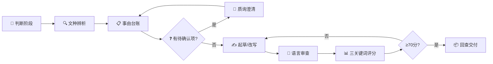

<div align="center">

# 公文通知写作技能

**理解目的 · 锁定要素 · 控制语气 · 一事一通知**

面向 Codex / Claude Code 的党政机关公文通知写作 AI Agent Skill

[](https://opensource.org/licenses/MIT)
[](https://openstd.samr.gov.cn/)
[](#7-种通知类型)
[](#样例索引)

[核心能力](#核心能力) · [7种通知类型](#7-种通知类型) · [工作流程](#工作流程) · [安装使用](#安装与使用) · [目录结构](#目录结构)

</div>

---

## 这不是什么

> [!IMPORTANT]
> 这不是"一键生成公文"工具。它不会 blindly 生成一篇像通知的文章，而是先理解行政目的，
> 锁定事由要素，控制语气梯度，确保一事一通知，在用户确认后才输出通知。

| 一键生成工具 | 本技能 |
|:---:|:---:|
| 凭主题猜内容 | 先建事由台账，锁定硬约束 |
| 不区分通知类型 | 7 种通知各有结构和语气规范 |
| 语气随机 | 三档语气梯度 + 部署口吻≠套话判断 |
| 可能编造事实 | 零编造 + 〔待补〕标注 |
| 批转/转发展开论述 | 硬规则：正文不超过3句 |
| 黑盒输出 | 三关键词量化评分 + 审查清单 |

## 核心能力

- **7 种通知类型** — 指示性/发布性/批转性/转发性/会议/任免/事务性
- **语气梯度** — 强部署/中要求/弱告知三档，标志词表+禁用词表
- **文种辨析** — 通知 vs 通报/决定/命令/批复/意见/函
- **三关键词质控** — 站位/逻辑/内容，5 维度 100 分量表
- **AI 痕迹检测** — 区分合法部署语言和套话
- **零编造** — 不添加用户未提供的事实和数据
- **格式联动** — 起草完成后可调用 `$document-format-skill` 做格式终审

## 五条底线

1. **一事一通知** — 不夹带不相关事项
2. **零编造** — 不添加用户未提供的事实
3. **语气梯度匹配** — 按类型匹配强/中/弱
4. **批转/转发不展开** — 正文不超过3句
5. **任免不添加** — 不写背景、希望、要求

## 7 种通知类型

| # | 类型 | 语气 | 典型篇幅 | 结构特征 |
|---|---|---|---|---|
| 1 | 指示性通知 | 强部署 | 1000-3000字 | 依据+总要求+分任务+保障+督查 |
| 2 | 发布性通知 | 中要求 | 正文100-300字 | 发布决定+执行要求（附件为核心） |
| 3 | 批转性通知 | 中要求 | 正文50-200字 | 批转决定+执行要求（≤3句） |
| 4 | 转发性通知 | 中/弱 | 正文50-200字 | 转发决定+补充要求（≤3句） |
| 5 | 会议通知 | 中要求 | 300-800字 | 时间+地点+内容+人员+要求 |
| 6 | 任免通知 | 弱告知 | 50-200字 | 任免决定（无结语无要求） |
| 7 | 事务性通知 | 弱/中 | 200-800字 | 事由+事项+要求 |

## 工作流程



## 安装与使用

### 方式一：Codex CLI

```bash
# 克隆到 skills 目录
git clone https://github.com/Bugu1012/official-notice-skill.git ~/.codex/skills/official-notice-skill
```

### 方式二：Claude Code

```bash
git clone https://github.com/Bugu1012/official-notice-skill.git ~/.claude/skills/official-notice-skill
```

### 使用

在对话中描述你的通知写作需求，技能会自动加载。示例：

- "帮我起草一份关于加强安全生产工作的通知"
- "把这段会议记录改写成会议通知"
- "审查这份通知有没有问题"

### 联动

起草完成后，可调用同系列 `$document-format-skill` 做文件式格式终审。

## 目录结构

```
公文通知写作.skill/
├── SKILL.md                    # 主技能文件
├── README.md                   # 本文件
├── LICENSE                     # MIT
├── 技能说明.md                  # 中文简要说明
├── agents/
│   └── openai.yaml             # Codex agent 配置
├── references/                 # 规则文件（18个）
│   ├── 通知的分类与适用.md
│   ├── 正文结构.md
│   ├── 撰写思路.md
│   ├── 语气梯度与措辞.md
│   ├── 句式库.md
│   ├── 文种辨析.md
│   ├── 常见错误图谱.md
│   ├── 通知语言自然化.md
│   ├── 自然化方法来源与适配.md
│   ├── 三关键词量化评估.md
│   ├── 规范依据.md
│   ├── 文件式格式.md
│   ├── 附件处理规则.md
│   ├── 主送抄送规则.md
│   ├── 个人助手方法论适配.md
│   ├── 开源技能参考借鉴.md
│   ├── 样例索引使用说明.md
│   └── 资料导航.md
└── assets/                     # 模板和工具（9个）
    ├── 通知起草模板.md
    ├── 通知改写提示卡.md
    ├── 通知审查清单.md
    ├── 结语速查表.md
    ├── 文种辨析速查表.md
    ├── 语气梯度速查表.md
    ├── 通知采集指南.md
    ├── 内部核验附注模板.md
    └── 真实公开样例索引.csv     # 326条样例
```

## 样例索引

326 条真实公开通知样例，来源为 gov.cn 及各部委网站：

| 类型 | 数量 |
|---|---|
| 指示性通知 | 96 |
| 发布性通知 | 80 |
| 会议通知 | 46 |
| 批转性通知 | 39 |
| 转发性通知 | 32 |
| 事务性通知 | 30 |
| 任免通知 | 3 |

## 规范依据

- GB/T 9704-2012《党政机关公文格式》
- 《党政机关公文处理工作条例》（中办发〔2012〕14号）

## 致谢与参考

本技能的构建参考了以下开源项目和方法论：

**同系列技能**
- [Bugu1012/document-format-skill](https://github.com/Bugu1012/document-format-skill) — 公文格式修订
- [Bugu1012/Meeting-minutes](https://github.com/Bugu1012/Meeting-minutes) — 会议纪要写作
- [Bugu1012/official-letter-skill](https://github.com/Bugu1012/official-letter-skill) — 公文函写作
- [Bugu1012/Meeting-minutes-writing-handbook](https://github.com/Bugu1012/Meeting-minutes-writing-handbook) — 会议纪要写作手册
- [Bugu1012/official-letter-writing-handbook](https://github.com/Bugu1012/official-letter-writing-handbook) — 公文函写作手册

**公文写作参考**
- [zhaohui-yang/official-document-drafting](https://github.com/zhaohui-yang/official-document-drafting) — 22种公文spec
- [Liuxiangjian-ai/official-document-skill](https://github.com/Liuxiangjian-ai/official-document-skill) — 文种表与表达模式
- [KaguraNanaga/official-document-writing-skill](https://github.com/KaguraNanaga/official-document-writing-skill) — 公文写作示例
- [Rimagination/gongwen-draft](https://github.com/Rimagination/gongwen-draft) — 公文起草Agent
- [HenryLau7/gongwen-writing](https://github.com/HenryLau7/gongwen-writing) — 公文改写
- [wocessade/gongwen-writing-skill](https://github.com/wocessade/gongwen-writing-skill) — 15种文种
- [dylanzhangzx/dknowc-official-doc-writer](https://github.com/dylanzhangzx/dknowc-official-doc-writer) — 公文写作助手
- [onlyLT/wow-gongwen-writing](https://github.com/onlyLT/wow-gongwen-writing) — 公文写作助手

**格式参考**
- [wzbwan/gongwen-format-skill](https://github.com/wzbwan/gongwen-format-skill) — 受控Markdown协议
- [pamelaaaaa1218/gongwen-format-skill](https://github.com/pamelaaaaa1218/gongwen-format-skill) — 国企公文格式

**文本自然化**
- [blader/humanizer](https://github.com/blader/humanizer) — 文本自然化方法
- [op741lst/Humanizer-zh](https://github.com/op741lst/Humanizer-zh) — 中文自然化

## License

[MIT](LICENSE)
